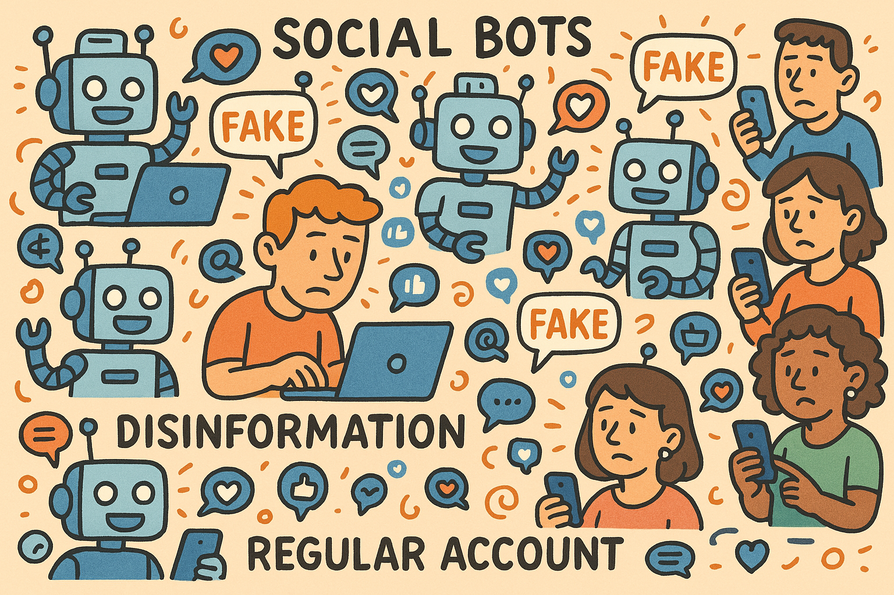

# MADD: Multi-Agent-based framework for Disinformation Dissemination

  

  <em>🤖  MADD to model the dynamic impact of social bots on disinformation spread and correction 🤖 </em>

## ✨ User/Bot Agent Attributes

We define five core attributes related to disinformation spread: interest community, trust threshold, dissemination tendency, social influence, and activation time.

The `UserBotAgentAttributes` folder contains the definitions of five types of user attributes.

'UserBotAgentAttributes/README. Md' shows this part in detail. [<a href="UserBotAgentAttributes/README.md">readme</a>]

## 🐣 Disinformation and Dissemination Rules

We set disinformation by community and plausibility. 

The 'Dataset/Disinformation' folder contains six topics we define types of disinformation, 'DisinformationRules/Prompt' folder shows us Prompt design on the rationality of evaluation of disinformation.

You can view the detailed readme file in the `DisinformationRules` folder. [<a href="DisinformationRules/README.md">readme</a>]

## 🦋 Disinformation Dissemination Network

We combine the Stochastic Block Model (SBM)  and Barabási-Albert Model (BAM) to generate disinformation propagation networks.

`DisseminationNetwork` folder contains a potential network of spread that we produce a certain proportion of malicious bots and legitimate bots, and together with ordinary human accounts.

You can view the detailed readme file in the `DisseminationNetwork` folder. [<a href="DisseminationNetwork/README.md">readme</a>]

## 🪸 Simulation

The execution code of our disinformation simulation based on the constructed MADD is presented in `SimulateExperiment`.

You can view the detailed readme file in the `SimulateExperiment` folder. [<a href="SimulateExperiment/README.md">readme</a>]