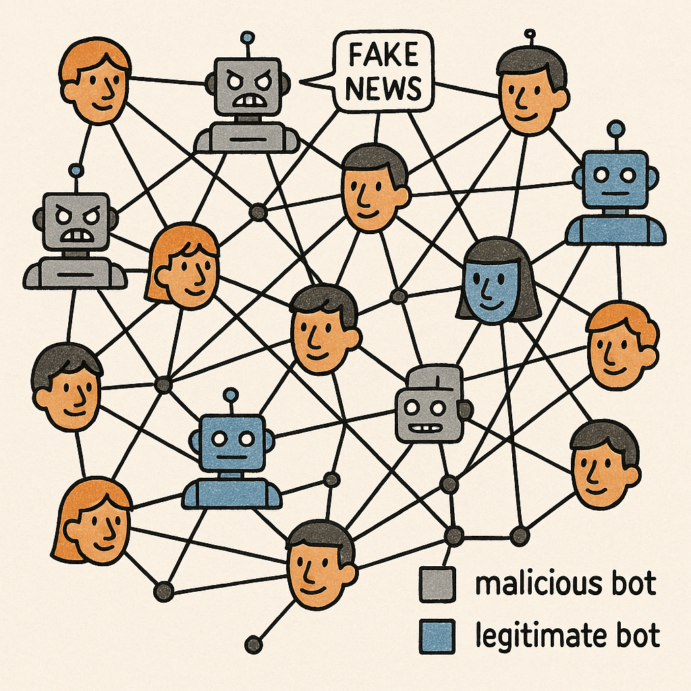
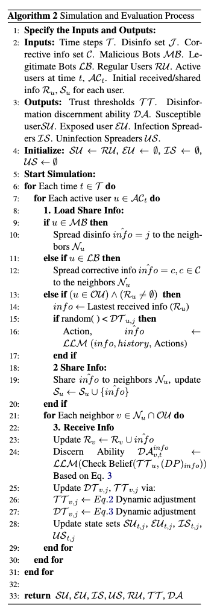

  

  🧟Simulate Disinformation Dissemination🧟

## 🐣 Simulate the spread of disinformation

We have designed three types of agents: malicious bot agents, legitimate bot agents and ordinary user agents. These three types of agents participate in the information propagation process through the information propagation simulation network we have constructed.

🐡 First, we assign explicit activation timesteps to ordinary users, malicious bots, and legitimate bots based on a Bernoulli distribution and to ensure that at least one bot is activated at the initial timestep by executing the scripts `python DataPreprocess/preprocess_activation_time_step.py`.

🪸 Second, we run `python conclude_humantext.py` operations to summarize the user's historical text information to assist the subsequent ordinary user agent in generating text content that conforms to the behavioral pattern.

🦋 Finally, we initiate the simulation by executing `python main.py`.  The detailed algorithmic workflow is as follows:

  

## 🐣 Folder Introduction

The content in `LBotAndMBot` is the code for running different correction strategies. The corresponding parameters can be set in `LBotAndMBot/config.yaml` to execute different correction strategies.

The contents in the `MBotAndHuman` folder are the control group that implements the policy without correction.

Executing `main.py` in the above two folders can obtain the simulation results.